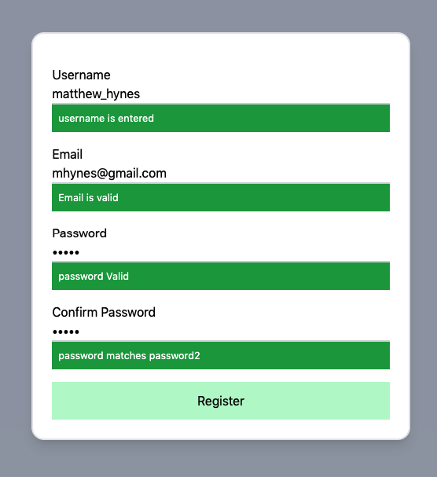
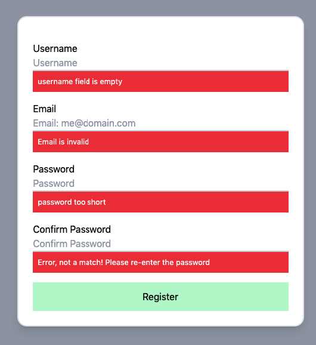
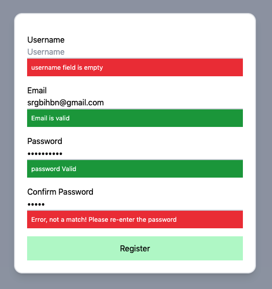

## Welcome to Form Validation

---------------------------

### Feel free to visit [My Vercel Portfolio](https://vercel.com/sauelalmonte).

### To view this project, please click below

[Form Validation](https://form-validation2.vercel.app/)

----------------------------------------

This project is an example of a : 
- Registration Form
- Login Form
- Sign Up From

These forms are used in everyday websites & applications.

The purpose of this form, is to validate the data being entered.

> Example's of Validation:

- Username field - Empty or Filled
- Email field - Validate it is an email
- Password Field's - Passwords match or do not match
- Fields - Meet minimum length requirements

----

### What happens if the field's meet all requirements or do not meet all requirements?

To view form in action, please click this link -> [Form Validation](https://form-validation2.vercel.app/)

Below you will see images of the form when all requirements are met or not met.

> Requirements are all met:

> Requirements not met:

> Some requirements met:

-----------------------------

### What languages & frameworks were used to create this form?

-----------------------------------
[TailwindCSS](https://tailwindcss.com/) was used for the Frontend

What is [TailwindCSS?](https://tailwindcss.com/)

*[TailwindCSS](https://tailwindcss.com/) is a utility first CSS Framework* that allows you to style/design, without leaving your html file.

> Example:

    <!--Header Starts-->
    

        

            
            

                <h2 class="text-red-600 font-bold text-3xl">Welcome To</h2>
                <h1 class="font-bold text-5xl text-purple-600">Form Validation</h1>
            

        

    

    <!--Header Ends-->

    <!--Form Starts-->
        

            

                <form id="registration-form">
                    

                        <label for="username">Username</label>
                        <input type="text" id="username" name="username" placeholder="Username"
                               class="base-input"
                        >
                            

                            

                    

                    

                        <label for="email">Email</label>
                        <input type="email" id="email" name="email" placeholder="Email: me@domain.com"
                               class="base-input"
                        >

                        

                        

                        <!--                        <small class="hidden">Please enter your username</small>-->
                        <!--                        <small class="hidden">✔️ Success</small>-->
                    

                    

                        <label for="password">Password</label>
                        <input type="password" id="password" name="password" placeholder="Password"
                               class="base-input"
                        >

                        

                        

                        <!--                        <small class="hidden">Please enter your username</small>-->
                        <!--                        <small class="hidden">✔️ Success</small>-->
                    

                    

                        <label for="password2">Confirm Password</label>
                        <input type="password" id="password2" name="password2" placeholder="Confirm Password"
                               class="base-input"
                        >

                        

                        

                        <!--                        <small class="hidden">Please enter your username</small>-->
                        <!--                        <small class="hidden">✔️ Success</small>-->
                    

                    <button class="bg-green-200 p-3 w-full">Register</button>
                </form>
            

        

    <!--Form Ends-->

